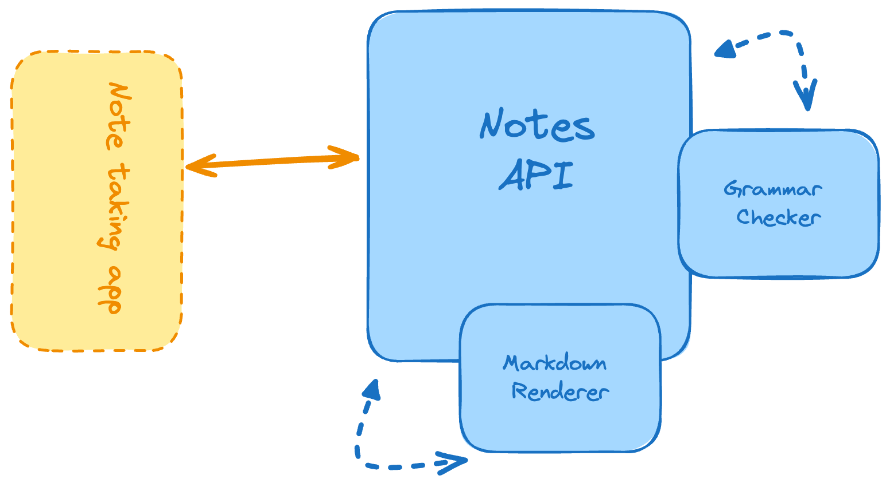

# Markdown Note-taking App

This project is a note-taking application that allows users to upload Markdown files, check the grammar of notes, save them, and render them in HTML. It’s an excellent way to practice handling files in a RESTful API, parsing and rendering Markdown files, and performing grammar checks on text.



## Features

- **Grammar Check**: Endpoint to verify and correct grammatical errors in a note.
- **Save Note**: Endpoint to save a note passed as Markdown text or .md files.
- **List Saved Notes**: Endpoint to list all saved notes.
- **HTML Rendering**: Endpoint that returns an HTML version of the Markdown note.

## Project Structure

```
.
├── app/
│   ├── note/                          # Notes-related functionality
│   │   ├── note_service.py            # Business logic for notes operations 
│   │   ├── note_module.py             
│   │   └── note_controller.py         # Routes and endpoints for notes-related actions
│   ├── schemas/                       # Schema definitions for data validation
│   │   └── schema.py                  # Schema classes for request data validation (Marshmallow)
│   ├── util/                          # Utility functions and helpers
│   │   └── util.py                    # Utility functions for response formatting, etc.
│   ├── app.py                         # Flask application initialization and setup
│   ├── config.py                      # Configuration settings (e.g., database URIs, API keys)
│   └── main.py                        # Main script to run the application
├── .env.example                       # Example environment variable file for sensitive data (e.g., keys)
├── README.md                          
└── requirements.txt                   # Python dependencies
        

```

## Installation

1. **Clone the repository**:
   ```bash
   git clone https://github.com/icyjkk/Backend-Projects.git
   cd Markdown-Note-Taking
   ```

3. **Install Python** (if not already installed):  

4. **Create and activate a virtual environment**:
   ```bash
   python -m venv venv
   source venv/bin/activate   # On Windows: venv\Scripts\activate
   ```

5. **Install the dependencies**:
   ```bash
   pip install -r requirements.txt
   ```

6. **Configure the `.env` file:**
   ```bash
   cp .env.example .env
   ```
   Inside `.env`, set up your environment variables:
   ```env
    DEBUG=True
    RATE_LIMITS="5 per second; 10 per minute; 100 per hour; 1000 per day"
   ```
   
7. **Run the application:**
   ```bash
   py -m app.main 
   ```

## API Endpoints

### Note
| Method | Endpoint                      | Description                                            |
|--------|-------------------------------|--------------------------------------------------------|
| POST   | `/note/check-grammar`         | Checks and corrects the grammar of a note in Markdown  |
| POST   | `/note/save-note`             | Saves a note passed as Markdown text or .md file.      |
| GET    | `/note/list-notes`            | Lists all saved notes                                  |
| GET    | `/note/render-note/<note_id>` | Returns the note rendered in HTML                      |

### Example Requests
```json
POST /note/check-grammar
{
  "note":"#Mi Título\nEste es el contenio de la nota en Markdown.",
  "language": "es" 
}
```
```json
RESPONSE:
{
    "data": {
        "detectedLanguage": "Spanish",
        "language": "Spanish",
        "matches": [
            {
                "errorType": "misspelling",
                "length": 8,
                "message": "Se ha encontrado un posible error ortográfico.",
                "offset": 21,
                "replacements": [
                    "contenido",
                    "contenía",
                    "convenio",
                    "contento",
                    "contentó",
                    "contendió",
                    "congenió",
                    "congenio",
                    "contengo",
                    "contenlo"
                ],
                "sentence": "Mi Título\nEste es el contenio de la nota en Markdown.",
                "shortMessage": "Error de ortografía"
            }
        ]
    },
    "message": "Grammar check completed successfully",
    "status": "success"
}
```

## Technologies Used

- **Flask**: Web framework for handling routes and requests.
- **Markdown Library**: Library for parsing and rendering Markdown files.
- **LanguageTool**: API for grammar checking.
- **dotenv**: For loading environment variables from the .env file.

## Contributing

Contributions are welcome! If you have suggestions or find a bug, feel free to create an issue or submit a pull request.
