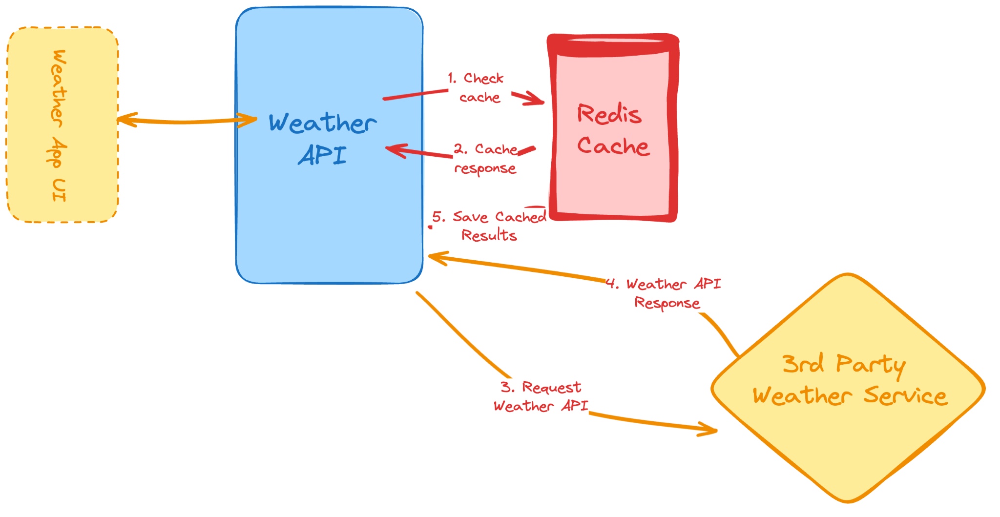

# Weather API

This project is a Flask-based weather API that retrieves weather data from an external API and caches the results using Redis. To prevent abuse of the API, rate limiting is implemented using the `flask-limiter` package, which controls the number of requests allowed within a certain time period.




## Features

- Fetch weather data by postal code.
- **Caching** mechanism using Redis to reduce external API requests.
- Automatically stores and serves cached data for 12 hours.
- **Rate limiting** to prevent abuse and overuse of the API.
- Handles external API errors, such as timeouts and invalid postal codes.

## Project Structure

```
.
├── app/                 
│   └── weather/           # Weather application folder
│       ├── __init__.py    # Initialization file
│       ├── weather_controller.py  # Controller handling API routes
│       ├── weather_module.py      
│       ├── weather_service.py     # Service handling weather data and caching
│       ├── app.py         # Entry point to create the Flask app and set up rate limiting
│       ├── config.py      # Configuration settings, including API keys
│       └── main.py        # Main script to run the app
├── .env.example          # Example environment variable file
├── README.md             
└── requirements.txt      # Python dependencies

```

## Installation

1. **Clone the repository**:
   ```bash
   git clone https://github.com/icyjkk/Backend-Projects.git
   cd Weather-Api
   ```

3. **Install Python** (if not already installed):  

4. **Create a virtual environment and activate it**:
   ```bash
   python -m venv venv
   source venv/bin/activate   # On Windows: venv\Scripts\activate
   ```

5. **Install the dependencies:**
   ```bash
   pip install -r requirements.txt
   ```

6. **Set up the `.env` file with your configuration:**
   ```bash
   cp .env.example .env
   ```
   In the `.env` file, add your API keys:
   ```env
   WEATHER_API_KEY=your_weather_api_key_here
   CACHE_SECRET_KEY=your_redis_password_here
   ```

7. **Ensure Redis is running locally or accessible through your cloud provider. Update the Redis connection details in the `weather_service.py` file if necessary.**

8. **Run the application:**
   ```bash
   python -m app.main
   ```

## API Endpoints

### `/weather/current`

**Method:** `GET`  
**Description:** Fetch current weather data for a specific postal code (only US codes). If the data is available in the cache, it will return cached data. Otherwise, it will fetch new data from the external API and store it in the cache.

**Parameters:**
- `postal_code`: The US postal code for which to retrieve weather data.

**Example Request:**
```
GET /weather/current?postal_code=90210
```

### `/weather/test`

**Method:** `GET`  
**Description:** Test endpoint to verify that the API is working correctly and that the API key is being accessed from the configuration.

## Rate Limiting

This API uses `flask-limiter` to restrict the number of requests allowed per client to prevent abuse.

- **Global Limit:** 100 requests per day and 10 requests per minute for all routes.

If a client exceeds these limits, they will receive a `429 Too Many Requests` response.

### Example Error Response:
```json
{
  "error": "Too many requests. Please try again later."
}
```

## Error Handling

The API handles various errors, such as:
- **Invalid Postal Code**: If the external API returns a 400 status for an invalid postal code.
- **API Timeout**: If the external API doesn't respond in time.

## Technologies Used

- **Flask**: Web framework used to build the API.
- **Redis**: Used for caching weather data to improve performance.
- **Requests**: Python library for making HTTP requests to the external weather API.
- **Flask-Limiter**: To implement rate limiting for the API.
- **dotenv**: For loading environment variables from a `.env` file.

## Contributing

Contributions are welcome! If you have suggestions or find a bug, feel free to create an issue or submit a pull request.
